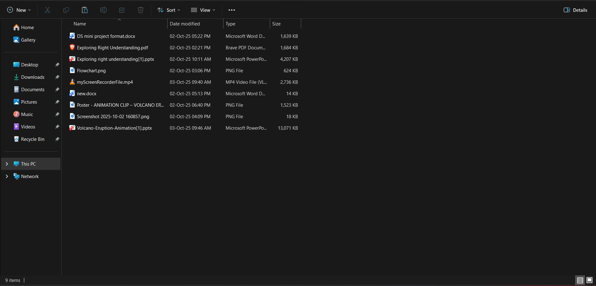
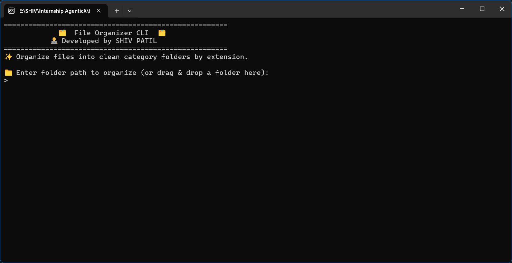
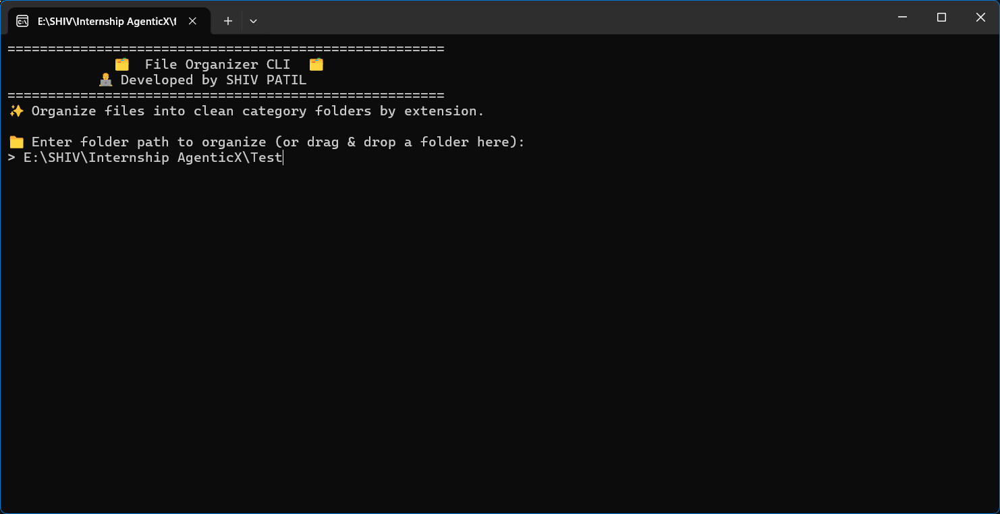
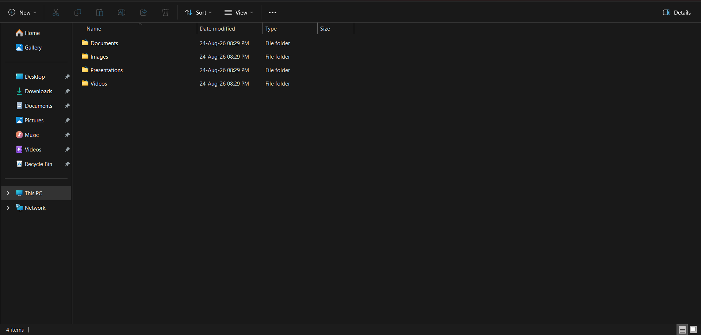

# 🗂️ File Organizer CLI

A robust, production-grade command-line tool built in Python to automatically sort and organize files in any directory into clean, categorized subfolders based on file extensions.

Built with a primary focus on **real error handling**, safety, sensible exit codes, informative `--help`, dry-run simulation, and clean `Ctrl+C` interrupt handling without exposing raw tracebacks to users.

---

## 📑 Table of Contents
1. [📌 Problem Statement](#1--problem-statement)
2. [🎯 Objective](#2--objective)
3. [🏗️ Approach / Architecture](#3-️-approach--architecture)
4. [💻 Technologies Used](#4--technologies-used)
5. [📁 Project Structure](#5--project-structure)
6. [🚀 Installation & Setup](#6--installation--setup)
7. [🖥️ How to Run](#7-️-how-to-run)
8. [📊 Results / Evaluation](#8--results--evaluation)
9. [📸 Screenshots & Demo](#9--screenshots--demo)
10. [📂 Supported File Types](#10--supported-file-types)
11. [🛡️ Real Error Handling & Edge Cases](#11-️-real-error-handling--edge-cases)
12. [🔢 Exit Codes Reference](#12--exit-codes-reference)
13. [🧠 Key Learnings](#13--key-learnings)
14. [🔮 Future Improvements](#14--future-improvements)
15. [📜 License & Author](#15--license--author)

---

## 1. 📌 Problem Statement

Directories such as `Downloads/`, `Desktop/`, and project asset folders rapidly accumulate hundreds of unorganized, mixed files over time. Manual sorting is tedious, error-prone, and repetitive.

Standard automation scripts frequently fail when encountering common edge cases:
- ❌ Crashing with raw, intimidating Python tracebacks when folders are missing or misnamed.
- ❌ Silently overwriting existing files when duplicate filenames exist in destination folders.
- ❌ Leaving corrupted or half-moved files when the process is interrupted mid-run (`Ctrl+C`).
- ❌ Crashing abruptly on locked files or permission-restricted folders.

There is a need for a **resilient, reliable CLI tool** that performs file organization efficiently while prioritizing **unhappy paths**—handling every potential failure gracefully, reporting user-friendly diagnostics to `stderr`, and returning standardized process exit codes.

---

## 2. 🎯 Objective

- **Automated Sorting**: Automatically scan files in a selected directory and sort them into designated category folders based on extensions.
- **Safety First**: Never silently overwrite or delete user files, and never modify files during `--dry-run` simulation mode.
- **Robust Error Handling**: Catch all file-system, path validation, and runtime exceptions with clear, helpful error messages and zero raw tracebacks.
- **Graceful Interrupt Handling**: Safely intercept `Ctrl+C` (`KeyboardInterrupt`), cancelling operations cleanly and exiting with standard exit code `130`.
- **Sensible Exit Codes**: Return strict, standardized POSIX exit codes (`0`, `1`, `2`, `3`, `130`) for clean automation and shell integration.
- **Self-Explanatory Help**: Provide comprehensive `--help` output with usage examples, exit codes, and supported extensions.
- **Dual-Mode Experience**: Support both standard command-line flags for power users and an interactive double-click window with drag-and-drop support for general end users.

---

## 3. 🏗️ Approach / Architecture

The application is structured into modular, single-responsibility components with defensive programming patterns:

```
                      ┌────────────────────────────┐
                      │    CLI / User Execution    │
                      └─────────────┬──────────────┘
                                    │
                         [Input Arguments Check]
                                    │
                ┌───────────────────┴───────────────────┐
                ▼                                       ▼
       [CLI Arguments Mode]                  [Interactive / No Args Mode]
    (e.g., python fileorganizer.py)           (e.g., double-clicked .exe)
                │                                       │
                └───────────────────┬───────────────────┘
                                    ▼
                      ┌────────────────────────────┐
                      │  Pre-Flight Validation     │
                      │  • Path existence          │
                      │  • Is Directory check      │
                      │  • Permission validation   │
                      └─────────────┬──────────────┘
                                    │
                                    ▼
                      ┌────────────────────────────┐
                      │ Directory Scanner & Filter │
                      │  • Root files only         │
                      │  • Skips subdirectories    │
                      │  • Detects extensions      │
                      └─────────────┬──────────────┘
                                    │
                                    ▼
                      ┌────────────────────────────┐
                      │    Categorization Engine   │
                      │  • Lowercase normalization │
                      │  • 8 Category mappings     │
                      │  • Fallback to 'Others'    │
                      └─────────────┬──────────────┘
                                    │
                     ┌──────────────┴──────────────┐
                     ▼                             ▼
            [--dry-run Active]             [Live Move Mode]
         • Preview output to stdout      • Collision check
         • 0 disk modifications          • Auto-create folders
         • Predict skips accurately      • shutil.move per file
                     │                   • Isolate per-file errors
                     │                             │
                     └──────────────┬──────────────┘
                                    ▼
                      ┌────────────────────────────┐
                      │   Summary & Exit Status    │
                      │  • Processed / Skipped     │
                      │  • Standard Exit Code      │
                      └────────────────────────────┘
```

### Key Architectural Principles:
1. **Pre-flight Validation**: Input paths are verified for existence, directory type, and readability before any move operations begin.
2. **Per-File Error Isolation**: An error on one locked or missing file will not crash the remaining files in the batch.
3. **Stream Separation**: Normal progress and dry-run outputs flow to `stdout`, while warnings and diagnostic error cards route to `stderr`.
4. **Top-Level Signal & Exception Safety Net**: All unexpected errors and `KeyboardInterrupt` events are caught cleanly at the boundary.

---

## 4. 💻 Technologies Used

- **Language**: Python 3.9+ (Python standard library only for zero-dependency runtime)
- **Filesystem & Paths**: `pathlib.Path` for cross-platform Windows, macOS, and Linux compatibility
- **File Operations**: `shutil` for atomic, secure file moving
- **CLI Parsing**: `argparse` with custom `SafeArgumentParser` for error trapping
- **Testing Framework**: `pytest` & `pytest-cov` for automated test coverage
- **Packaging & Distribution**: `PyInstaller` for compiling standalone Windows `.exe` binaries
- **Version Control**: Git & GitHub

---

## 5. 📁 Project Structure

```text
file-organizer-cli/
├── README.md                 # Project documentation & evaluation guide
├── requirements.txt          # Development dependencies (pytest)
├── .gitignore                # Exclusions for virtual envs, builds, and caches
│
├── src/                      # Source code package
│   ├── __init__.py           # Package exports
│   └── fileorganizer.py      # Core organizer logic, CLI parser & error handlers
│
├── fileorganizer.py          # Root entrypoint runner
│
├── data/                     # Safe mock sample data for testing and demonstration
│   ├── photo.jpg
│   ├── resume.pdf
│   ├── document.docx
│   ├── budget.xlsx
│   ├── presentation.pptx
│   ├── song.mp3
│   ├── video.mp4
│   ├── archive.zip
│   ├── notes.txt
│   └── unknown.xyz
│
├── outputs/                  # Sample execution logs and test run outputs
│   └── sample_organization_log.txt
│
├── screenshots/              # Visual demonstration captures
│   ├── 1Before.png
│   ├── 2Onboarding.png
│   ├── 3input.png
│   ├── 4Preview before proceed.png
│   ├── 5Operation Done.png
│   └── 6After.png
│
├── dist/                     # Compiled standalone executable
│   └── fileorganizer.exe     # Zero-dependency Windows binary
│
└── tests/                    # Automated pytest test suite (27 tests)
    ├── __init__.py
    ├── test_cli.py           # CLI argument parsing, --help & end-to-end tests
    ├── test_organization.py  # Category mapping & directory organization tests
    └── test_errors.py        # Unhappy paths, collisions, permissions & signals
```

---

## 6. 🚀 Installation & Setup

### 1. Clone the repository
```powershell
git clone <repository-url>
cd file-organizer-cli
```

### 2. Create a virtual environment
```powershell
python -m venv .venv
```

### 3. Activate the virtual environment
- **On Windows (PowerShell):**
  ```powershell
  .\.venv\Scripts\Activate.ps1
  ```
  *(If execution policies block script activation in PowerShell, run: `Set-ExecutionPolicy -Scope Process -ExecutionPolicy Bypass`)*

- **On Windows (Command Prompt):**
  ```cmd
  .\.venv\Scripts\activate.bat
  ```

- **On macOS / Linux:**
  ```bash
  source .venv/bin/activate
  ```

### 4. Install dependencies (for development/testing)
```powershell
pip install -r requirements.txt
```

### 5. (Optional) Build Standalone Windows Executable (.exe)
```powershell
pip install pyinstaller
pyinstaller --onefile --name fileorganizer fileorganizer.py
```
The standalone binary will be generated at `dist/fileorganizer.exe`.

---

## 7. 🖥️ How to Run

### Method 1: Standard CLI Mode (Terminal / PowerShell)

- **Preview files before moving (Dry-Run):**
  ```powershell
  python fileorganizer.py data --dry-run
  ```

- **Organize a directory:**
  ```powershell
  python fileorganizer.py data
  ```

- **Organize with an absolute path on Windows:**
  ```powershell
  python fileorganizer.py "C:\Users\Username\Downloads"
  ```

- **Display comprehensive help screen:**
  ```powershell
  python fileorganizer.py --help
  ```

---

### Method 2: Double-Click Interactive Mode (`fileorganizer.exe`)

For non-technical users, simply double-click `dist\fileorganizer.exe` in Windows Explorer:
1. An interactive terminal window opens with a welcome banner.
2. Enter the folder path or **drag and drop** a folder directly into the window.
3. Select whether to preview with **Dry Run** (`[Y/n]`).
4. Review the preview and confirm to proceed (`[y/N]`).
5. The window remains open until you press **Enter** so results can be reviewed.

---

## 8. 📊 Results / Evaluation

### Automated Test Suite
The tool was tested against **27 automated test cases** using `pytest`, achieving **100% pass rate**:

```powershell
pytest -v
```

**Test Execution Results:**
```text
============================= test session starts =============================
platform win32 -- Python 3.13.12, pytest-9.1.1, pluggy-1.6.0
rootdir: E:\SHIV\Internship AgenticX\file-organizer-cli

tests/test_cli.py::TestCLIParsing::test_help_flag_displays_usage_and_examples PASSED       [  3%]
tests/test_cli.py::TestCLIParsing::test_missing_directory_argument_fails_cleanly PASSED    [  7%]
tests/test_cli.py::TestCLIParsing::test_end_to_end_cli_execution PASSED                  [ 11%]
tests/test_cli.py::TestCLIParsing::test_end_to_end_cli_dry_run_execution PASSED         [ 14%]
tests/test_errors.py::TestValidationErrors::test_missing_directory_raises_filenotfound PASSED [ 18%]
tests/test_errors.py::TestValidationErrors::test_file_instead_of_directory_raises_notadirectory PASSED [ 22%]
tests/test_errors.py::TestValidationErrors::test_missing_directory_cli_exit_code_and_message PASSED [ 25%]
tests/test_errors.py::TestValidationErrors::test_file_as_directory_cli_exit_code_and_message PASSED [ 29%]
tests/test_errors.py::TestFileCollisionAndSafety::test_destination_file_exists_skips_and_does_not_overwrite PASSED [ 33%]
tests/test_errors.py::TestFileCollisionAndSafety::test_dry_run_destination_collision_warning PASSED [ 37%]
tests/test_errors.py::TestRuntimeFailures::test_file_disappears_during_processing PASSED [ 40%]
tests/test_errors.py::TestRuntimeFailures::test_permission_denied_on_individual_file_move PASSED [ 44%]
tests/test_errors.py::TestRuntimeFailures::test_permission_denied_on_directory_access PASSED [ 48%]
tests/test_errors.py::TestInterruptionAndSignals::test_keyboard_interrupt_returns_130_with_clean_message PASSED [ 51%]
tests/test_errors.py::TestInterruptionAndSignals::test_unexpected_exception_returns_1_without_raw_traceback PASSED [ 55%]
tests/test_organization.py::TestCategoryMapping::test_image_extensions PASSED             [ 59%]
tests/test_organization.py::TestCategoryMapping::test_document_extensions PASSED          [ 62%]
tests/test_organization.py::TestCategoryMapping::test_spreadsheet_extensions PASSED       [ 66%]
tests/test_organization.py::TestCategoryMapping::test_presentation_extensions PASSED      [ 70%]
tests/test_organization.py::TestCategoryMapping::test_audio_extensions PASSED             [ 74%]
tests/test_organization.py::TestCategoryMapping::test_video_extensions PASSED             [ 77%]
tests/test_organization.py::TestCategoryMapping::test_archive_extensions PASSED           [ 81%]
tests/test_organization.py::TestCategoryMapping::test_unrecognized_and_no_extension PASSED [ 85%]
tests/test_organization.py::TestDirectoryOrganization::test_organize_multiple_categories PASSED [ 88%]
tests/test_organization.py::TestDirectoryOrganization::test_subdirectories_are_not_moved PASSED [ 92%]
tests/test_organization.py::TestDirectoryOrganization::test_empty_directory_handling PASSED [ 96%]
tests/test_organization.py::TestDirectoryOrganization::test_dry_run_mode_makes_no_changes PASSED [100%]

============================= 27 passed in 0.80s ==============================
```

---

## 9. 📸 Screenshots & Demo

### Step 1: Messy Directory Before Organization
Files of mixed extensions (`.jpg`, `.pdf`, `.docx`, `.xlsx`, `.mp3`, etc.) scattered in root folder.



---

### Step 2: Interactive Application Launch
Double-clicking `fileorganizer.exe` greets the user with clean branding and prompts.



---

### Step 3: Entering Folder Path
The user provides the target directory path (supports direct typing or drag & drop).



---

### Step 4: Dry-Run Preview & Confirmation Prompt
The preview displays all projected moves and asks for user confirmation before making any disk changes.


---

### Step 5: Successful Execution & Summary
Files are organized into category folders, displaying total processed/skipped counts and author credits.


---

### Step 6: Clean Directory Structure After Organization
Category folders (`Images/`, `Documents/`, `Spreadsheets/`, `Audio/`, etc.) neatly created.



---

## 10. 📂 Supported File Types

| Category | Extensions | Icon |
| :--- | :--- | :---: |
| **Images** | `.jpg`, `.jpeg`, `.png`, `.gif`, `.bmp`, `.webp`, `.svg` | 🖼️ |
| **Documents** | `.pdf`, `.doc`, `.docx`, `.txt`, `.rtf`, `.odt` | 📄 |
| **Spreadsheets** | `.xls`, `.xlsx`, `.csv` | 📊 |
| **Presentations**| `.ppt`, `.pptx` | 📽️ |
| **Audio** | `.mp3`, `.wav`, `.aac`, `.flac`, `.ogg` | 🎵 |
| **Videos** | `.mp4`, `.mkv`, `.avi`, `.mov`, `.wmv` | 🎬 |
| **Archives** | `.zip`, `.rar`, `.7z`, `.tar`, `.gz` | 📦 |
| **Others** | Any unrecognized extension or extensionless file | 📁 |

*Note: File extension checks are case-insensitive (`.JPG`, `.Pdf`, `.PNG` are mapped identically).*

---

## 11. 🛡️ Real Error Handling & Edge Cases

| Scenario / Unhappy Path | How It Is Handled | User-Facing Message | Exit Code |
| :--- | :--- | :--- | :---: |
| ❌ **Missing Directory** | Validated before scanning | `Error: Directory 'folder' does not exist.` | `2` |
| ❌ **Target is a File** | Checks `is_dir()` | `Error: 'file.txt' is not a directory.` | `2` |
| ❌ **Missing CLI Argument** | Custom `SafeArgumentParser` | `Error: the following arguments are required: directory` | `2` |
| 🔒 **Permission Denied (Directory)** | Traps `PermissionError` on `iterdir()` | `Error: Permission denied while accessing 'folder'.` | `3` |
| ⚠️ **Destination File Collision** | Pre-checks destination before move | `Warning: 'photo.jpg' already exists in 'Images/'. Skipping.` | `0` |
| 💨 **File Vanished Mid-Run** | Traps `FileNotFoundError` during move | `Error: Could not move 'photo.jpg': File no longer exists.` | Continues |
| 🚫 **Locked File / Move Permission** | Traps per-file `PermissionError` | `Error: Could not move 'locked.txt': Permission denied.` | Continues |
| 🛑 **User Interruption (`Ctrl+C`)** | Traps `KeyboardInterrupt` cleanly | `\nOperation cancelled by user.` | `130` |
| 💥 **Unexpected Error** | Top-level safety net | `Error: An unexpected problem occurred.\nTry running the command again or use --help.` | `1` |

---

## 12. 🔢 Exit Codes Reference

| Exit Code | Constant Name | Scenario |
| :---: | :--- | :--- |
| **`0`** | `EXIT_SUCCESS` | All operations succeeded, or `--dry-run` simulation finished normally. |
| **`1`** | `EXIT_UNEXPECTED_ERROR` | Unhandled exception caught safely by top-level safety net. |
| **`2`** | `EXIT_INVALID_INPUT` | Missing directory, path points to a file, or invalid arguments. |
| **`3`** | `EXIT_ORGANIZER_ERROR` | File-system access failure or permission denied on directory. |
| **`130`**| `EXIT_INTERRUPTED` | Process cleanly stopped by user pressing `Ctrl+C` (`SIGINT`). |

---

## 13. 🧠 Key Learnings

1. **Defensive Programming over Monolithic Try-Blocks**:
   - Rather than wrapping an entire program in one massive `try...except`, validating inputs upfront and isolating individual file operations produces vastly superior error diagnostics.
2. **Separation of Standard Streams (`stdout` vs `stderr`)**:
   - Routing operational logs to `stdout` and warnings/errors to `stderr` enables clean redirection in automated scripting pipelines.
3. **Signal Trapping & Process Lifecycle**:
   - Intercepting `KeyboardInterrupt` ensures that users never see a raw Python traceback when cancelling with `Ctrl+C`, exiting with the standard code `130`.
4. **Cross-Platform Path Hygiene**:
   - Utilizing Python's standard `pathlib.Path` avoids fragile manual string concatenations (`/` vs `\`), ensuring bulletproof execution across Windows, Linux, and macOS.
5. **Dual-Mode CLI & GUI Hybrid UX**:
   - Designing the tool to work both as a headless CLI utility and an interactive console when double-clicked significantly enhances end-user accessibility.

---

## 14. 🔮 Future Improvements

- ⚙️ **Custom Configuration Profiles**: Support for `.fileorganizerrc` or `config.json` allowing user-defined custom categories and extensions.
- 📅 **Date-Based Organization**: Option to organize files chronologically by year and month (e.g., `2024/August/`).
- ⏪ **Reversible Undo / Rollback**: A transaction manifest log allowing users to undo any batch operation with `python fileorganizer.py undo`.
- 🔁 **Recursive Directory Sorting**: Optional `--recursive` flag to organize nested folder trees.
- 🔍 **Checksum Deduplication**: SHA256 content hashing to detect identical duplicate files regardless of differing names.

---

## 15. 📜 License & Author

### License
This project is open-source and licensed under the **MIT License**.

---

### 👨‍💻 Author
Developed with ❤️ by **SHIV PATIL**

✨ *Thanks for using file organizer!* ✨
